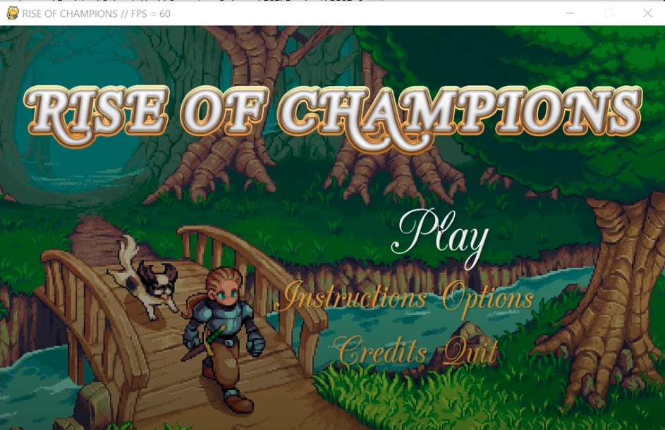
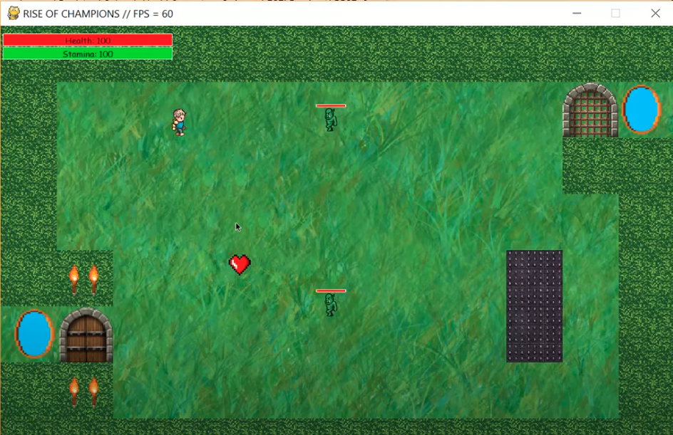
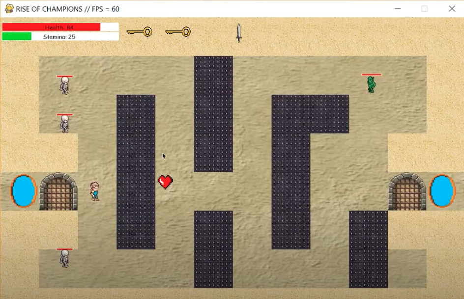

# Rise of Champions

A single player role playing game made with Python and Pygame! ([Demo Video](https://youtu.be/JyA5cyDM9B8))

By [Cameron Beneteau](https://github.com/CameronBeneteau) and [Jack Li](https://github.com/jackli10345)  
Course: Computer Science IC34U (Grade 11)  
Date: June 23rd, 2017  
Grade: 100%

## Table of Contents
[1. Intro](#Intro)  
[2. Gameplay](#Gameplay)  
[3. Environment Setup](#Environment-Setup)  
[4. How to Play](#How-to-Play)  
[5. Results](#Results)  
[6. Next Steps](#Next-Steps)

## Intro

This is a single-player adventure role playing game.

It was made using Python and Pygame. It utilizes object-oriented programming and other ICS3U computing techniques.

## Gameplay

Check out the demo video for this project [here](https://youtu.be/JyA5cyDM9B8)!

  
  
  

## Environment Setup

To successfully run this project, please follow these steps to set up your environment:

1. Python 3.0 or later ([Download Python](https://www.python.org/downloads/))
2. Any IDE that runs Python (we recommend [IDLE](https://www.python.org/downloads/), [IntelliJ IDEA](https://www.jetbrains.com/idea/) or [VS Code](https://code.visualstudio.com/download))
3. PyGame Module installed to your version of Python ([Download PyGame](https://www.python.org/downloads/))
4. Ensure your IDE is configured to use the above version of Python and PyGame

## How to Play

All instructions can be found in the game by navigating to the "Instructions" tab on the main menu.

Run the [rise-of-champions.py](rise-of-champions.py) file to play!

## Results

All-in-all, the project was a great success! We had an enjoyable time developing this game while learning Python, Pygame and object-oriented programming.

Even better: Our classmates and teachers also competed to see who could finish our game the fastest!

**Grade: 100%**

## Next Steps
Some fun things we would like to build on or explore relating to this project would be:

- More diverse set of enemies
- Intelligent enemies that jump, attack, etc.
- Add a story line including more levels and various themes
- Ability for players to customize their own characters
